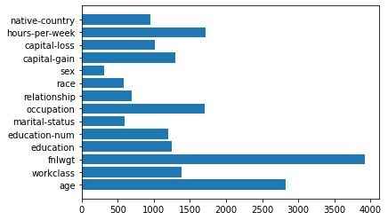

[](https://github.com/Hearsch-Jariwala/Flaml_AutoML/actions/workflows/main.yml)
# Flaml AutoML
FLAML (Fast and Lightweight AutoML) is a lightweight and efficient library implemented in Python and it has a scikit-learn style API. It allows the users to not worry about selecting the right machine learning algorithms or hyperparameters for each algorithm.

[Documentation](https://microsoft.github.io/FLAML/docs/Use-Cases/Task-Oriented-AutoML/)

## Dataset
The ‘Adult’ dataset from the Penn Machine Learning Benchmarks (PMLB) repo. 
This dataset was extracted from the 1994 census database. In this dataset, there is a binary column that tells whether a person makes over 50K a year. We will use this as the target variable for building ML models.

## Getting Started

1) Create a virtual environment.

```
cd Flaml_AutoML/
virtualenv venv
```

2) Activate the virtual environment.
  
- Mac:
```
source venv/bin/activate
```

- Windows :

```
.\venv\Scripts\activate
```

3) Then run: **(recommended)**

```
make all
```

- or install the requirements using pip.

```
pip install -r requirements.txt
```


## Usage

To run the file :

```
python3 auto_fl.py
```
## Results
```
[flaml.automl: 08-04 00:06:45] {2444} INFO - task = classification
INFO:flaml.automl:task = classification
[flaml.automl: 08-04 00:06:45] {2446} INFO - Data split method: stratified
INFO:flaml.automl:Data split method: stratified
[flaml.automl: 08-04 00:06:45] {2449} INFO - Evaluation method: holdout
INFO:flaml.automl:Evaluation method: holdout
[flaml.automl: 08-04 00:06:46] {2568} INFO - Minimizing error metric: 1-roc_auc
INFO:flaml.automl:Minimizing error metric: 1-roc_auc
[flaml.automl: 08-04 00:06:46] {2617} WARNING - No search budget is provided via time_budget or max_iter. Training only one model per estimator. To tune hyperparameters for each estimator, please provide budget either via time_budget or max_iter.
WARNING:flaml.automl:No search budget is provided via time_budget or max_iter. Training only one model per estimator. To tune hyperparameters for each estimator, please provide budget either via time_budget or max_iter.
INFO:flaml.default.suggest:metafeature distance: 0.8150715968660169
INFO:flaml.default.suggest:metafeature distance: 0.8150715968660169
INFO:flaml.default.suggest:metafeature distance: 0.8150715968660169
INFO:flaml.default.suggest:metafeature distance: 0.8150715968660169
INFO:flaml.default.suggest:metafeature distance: 0.8674313303290575
INFO:flaml.default.suggest:metafeature distance: 0.8150715968660169
[flaml.automl: 08-04 00:06:46] {2708} INFO - List of ML learners in AutoML Run: ['extra_tree', 'lgbm', 'rf', 'xgboost', 'xgb_limitdepth', 'lrl1']
INFO:flaml.automl:List of ML learners in AutoML Run: ['extra_tree', 'lgbm', 'rf', 'xgboost', 'xgb_limitdepth', 'lrl1']
[flaml.automl: 08-04 00:06:46] {3010} INFO - iteration 0, current learner extra_tree
INFO:flaml.automl:iteration 0, current learner extra_tree
[flaml.automl: 08-04 00:07:15] {3144} INFO - Estimated sufficient time budget=295458s. Estimated necessary time budget=3584s.
INFO:flaml.automl:Estimated sufficient time budget=295458s. Estimated necessary time budget=3584s.
[flaml.automl: 08-04 00:07:15] {3196} INFO -  at 30.4s,	estimator extra_tree's best error=0.0871,	best estimator extra_tree's best error=0.0871
INFO:flaml.automl: at 30.4s,	estimator extra_tree's best error=0.0871,	best estimator extra_tree's best error=0.0871
[flaml.automl: 08-04 00:07:15] {3010} INFO - iteration 1, current learner lgbm
INFO:flaml.automl:iteration 1, current learner lgbm
[flaml.automl: 08-04 00:07:18] {3196} INFO -  at 32.7s,	estimator lgbm's best error=0.0751,	best estimator lgbm's best error=0.0751
INFO:flaml.automl: at 32.7s,	estimator lgbm's best error=0.0751,	best estimator lgbm's best error=0.0751
[flaml.automl: 08-04 00:07:18] {3010} INFO - iteration 2, current learner rf
INFO:flaml.automl:iteration 2, current learner rf
[flaml.automl: 08-04 00:07:48] {3196} INFO -  at 63.5s,	estimator rf's best error=0.0958,	best estimator lgbm's best error=0.0751
INFO:flaml.automl: at 63.5s,	estimator rf's best error=0.0958,	best estimator lgbm's best error=0.0751
[flaml.automl: 08-04 00:07:48] {3010} INFO - iteration 3, current learner xgboost
INFO:flaml.automl:iteration 3, current learner xgboost
[flaml.automl: 08-04 00:11:00] {3196} INFO -  at 255.0s,	estimator xgboost's best error=0.0864,	best estimator lgbm's best error=0.0751
INFO:flaml.automl: at 255.0s,	estimator xgboost's best error=0.0864,	best estimator lgbm's best error=0.0751
[flaml.automl: 08-04 00:11:00] {3010} INFO - iteration 4, current learner xgb_limitdepth
INFO:flaml.automl:iteration 4, current learner xgb_limitdepth
[flaml.automl: 08-04 00:12:08] {3196} INFO -  at 323.2s,	estimator xgb_limitdepth's best error=0.0780,	best estimator lgbm's best error=0.0751
INFO:flaml.automl: at 323.2s,	estimator xgb_limitdepth's best error=0.0780,	best estimator lgbm's best error=0.0751
[flaml.automl: 08-04 00:12:08] {3010} INFO - iteration 5, current learner lrl1
INFO:flaml.automl:iteration 5, current learner lrl1
INFO:flaml.searcher.blendsearch:No low-cost partial config given to the search algorithm. For cost-frugal search, consider providing low-cost values for cost-related hps via 'low_cost_partial_config'. More info can be found at https://microsoft.github.io/FLAML/docs/FAQ#about-low_cost_partial_config-in-tune
/usr/local/lib/python3.7/dist-packages/sklearn/linear_model/_sag.py:354: ConvergenceWarning: The max_iter was reached which means the coef_ did not converge
  ConvergenceWarning,
[flaml.automl: 08-04 00:12:10] {3196} INFO -  at 325.1s,	estimator lrl1's best error=0.4057,	best estimator lgbm's best error=0.0751
INFO:flaml.automl: at 325.1s,	estimator lrl1's best error=0.4057,	best estimator lgbm's best error=0.0751
[flaml.automl: 08-04 00:12:12] {3456} INFO - retrain lgbm for 1.5s
INFO:flaml.automl:retrain lgbm for 1.5s
[flaml.automl: 08-04 00:12:12] {3461} INFO - retrained model: LGBMClassifier(colsample_bytree=0.5261441571042451,
               learning_rate=0.04824748268727149, max_bin=511,
               min_child_samples=8, n_estimators=141, num_leaves=139,
               reg_alpha=0.0028969208338993344, reg_lambda=0.024463247502165594,
               verbose=-1)
INFO:flaml.automl:retrained model: LGBMClassifier(colsample_bytree=0.5261441571042451,
               learning_rate=0.04824748268727149, max_bin=511,
               min_child_samples=8, n_estimators=141, num_leaves=139,
               reg_alpha=0.0028969208338993344, reg_lambda=0.024463247502165594,
               verbose=-1)
[flaml.automl: 08-04 00:12:12] {2739} INFO - fit succeeded
INFO:flaml.automl:fit succeeded
[flaml.automl: 08-04 00:12:12] {2741} INFO - Time taken to find the best model: 32.66448903083801
INFO:flaml.automl:Time taken to find the best model: 32.66448903083801
Best ML leaner: lgbm
Best hyperparmeter config: {'n_estimators': 141, 'num_leaves': 139, 'min_child_samples': 8, 'learning_rate': 0.04824748268727149, 'log_max_bin': 9, 'colsample_bytree': 0.5261441571042451, 'reg_alpha': 0.0028969208338993344, 'reg_lambda': 0.024463247502165594}
              precision    recall  f1-score   support

           0       0.79      0.67      0.72      2355
           1       0.90      0.94      0.92      7414

    accuracy                           0.88      9769
   macro avg       0.84      0.80      0.82      9769
weighted avg       0.87      0.88      0.87      9769
```
## Sample Output


## Citation
```
@inproceedings{wang2021flaml,
    title={FLAML: A Fast and Lightweight AutoML Library},
    author={Chi Wang and Qingyun Wu and Markus Weimer and Erkang Zhu},
    year={2021},
    booktitle={MLSys}
```

